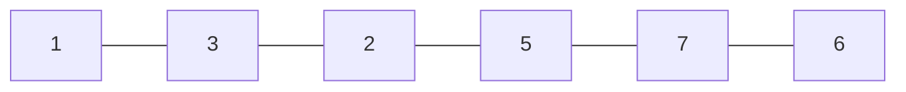
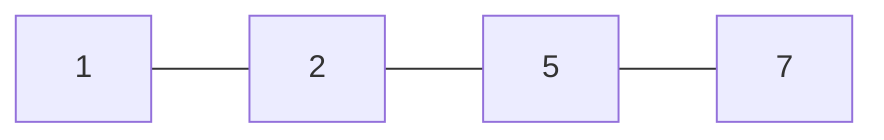

## Problema
A questão é encontrar o tamanho da maior subsequência crescente em uma lista, por exemplo:
Dado a lista:

Encontro o tamanho da maior subsequência de números estritamente crescente, neste caso seria a lista:

Que teria tamanho $4$.

## Solução $O(n^2)$
Uma solução possível é definir uma $\text{dp}$ da seguinte forma,
o primeiro elemento será definido como $1$, ou seja $dp[0] = 1$,
agora para todos os elementos para frente do elemento na posição $0$, temos que caso o elemento seja maior que o valor da posição inicial da busca manteremos o valor base, já que não se mantem uma ordem crescente, já no caso que o valor seja menor que o na posição inicial teremos que o valor será definido da seguinte forma, $\text{dp}[j] = \text{max}(\text{dp}[j], \text{dp}[i] + 1)$
desta forma caso em outro caso exista um valor anterior a $i$ que gere uma subsequência maior, mantem o valor, mas caso
a cadeia feita pelos os elementos anteriores mais o elemento $i$ e mais o elemento $j$ seja maior teremos que o tamanho da maior subsequência que usa esse valor terminará naquela posição. Depois repete esse processo em cada elemento do *array* buscando da posição do elemento até o final.
Um exemplo de implementação é a seguinte:
```cpp
#include <bits/stdc++.h>
using namespace std;
void solve(void) {
	int n;
	cin >> n;
	vector<int> x(n);
	for(auto &i: x) {
		cin >> i;
	}
	vector<int>dp(n+1, 1);
	int maxx = 0;
	for(int i = 0; i < x.size(); i++) {
		for(int j = i + 1; j < x.size(); j++) {
			if(x[i] > x[j]) {
				dp[j] = max(dp[i]+1, dp[j]);
				maxx = max(dp[j], maxx);
			}
		}
	}
	cout << maxx << endl;
}
int main(void) {
	solve();
	return 0;
}
```

## Solução $O(n\times log(n))$
A solução mais atual utiliza uma abordagem mista utilizando algoritmos gulosos e busca binária.
A grande sacada é manter um *array* de suporte. A sacada é que a medida que iteramos sobre os *array* dos elementos fazemos uma busca binária neste array de suporte buscando a posição do *lower bound* para o valor ou seja, buscamos o menor valor possível presente no *array* de suporte que seja maior ou igual ao valor que está sendo buscado, desta forma temos que quando encontramos esse *lower bound*, pegamos sua posição e colocamos o novo valor valor no lugar desse valor no *array* de suporte, caso o valor seja maior que qualquer outro valor presente no array de suporte adicionamos esse valor ao final do *array*, assim sempre que encontramos um valor que possa aumentar a nossa cadeia original basta adicionar ao final, e, de forma intuitiva, podemos ver que mudamos o valor no *array* de suporte pois assim garantimos que caso exista um nova cadeia mais para frente que seja feita com valores menores que seja maior que a anterior teremos o menor valor até então. 


```cpp
#include <bits/stdc++.h>
using namespace std;

int bs(vector<int> &arr, int target) {
	if (arr.size() == 0) {
		return -1;
	}
	if (arr.size() == 1) {
		if (arr[0] >= target) {
			return 0;
		}
		return -1;
	}
	int l = 0, r = arr.size() - 1;
	while (l <= r) {
		int m = l + (r - l) / 2;
		if (m == 0) {
			if (arr[m] >= target) {
				return m;
			} else if (arr[m + 1] >= target) {
				return m + 1;
			}
			return -1;
		}
		if (arr[m] >= target && arr[m - 1] < target) {
			return m;
		}
	
		if (arr[m] < target) {
			l = m + 1;
		} else {
			r = m - 1;
		}
	}
	return -1;
}
void solve(void) {
	int n;
	cin >> n;
	vector<int> x(n);
	for (auto &i : x) {
		cin >> i;
	}
	vector<int> holder;
	int maxx = 0;
	for (int i = 0; i < x.size(); i++) {
		int pos = bs(holder, x[i]);
		if (pos == -1) {
			holder.push_back(x[i]);
		} else {
			holder[pos] = x[i];
		}
	}
	cout << holder.size() << endl;
}
int main(void) {
	solve();
	return 0;
}
```


